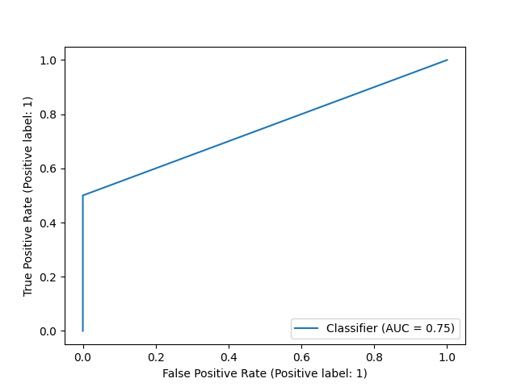
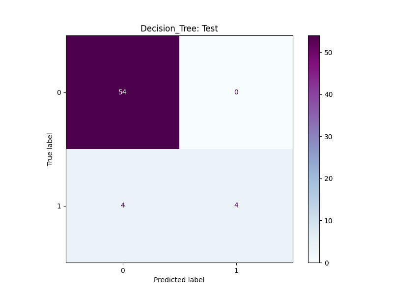
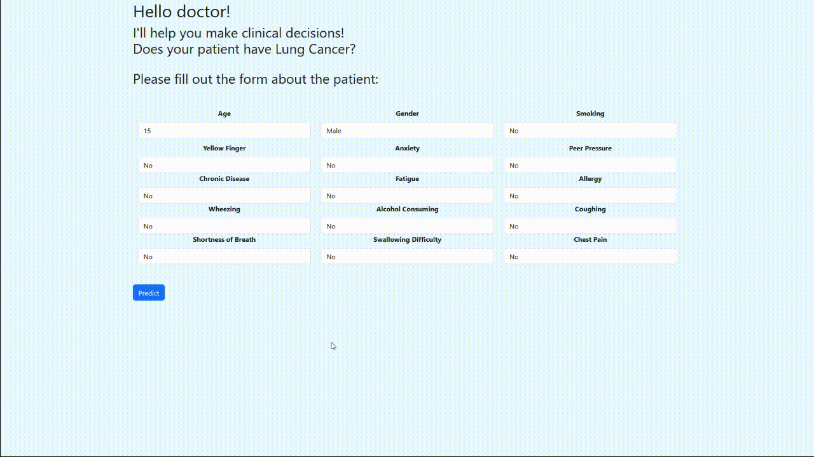

# Lung Cancer Prediction Model

## Abstract

The goal of this project is to create a machine learning model capable of predicting lung cancer in patients based on their lifestyle.

The best-performing model utilizes a Decision Tree algorithm, achieving an AUC Score of 75% and a precision of 1.

## Introduction

Lung cancer is one of the most prevalent types of cancer worldwide. Currently, it is the leading cancer diagnosis in the USA.

Lung cancer is closely related to the patient's lifestyle and environment. Additionally, genetic factors and heredity play a significant role.

Typically, lung cancer is diagnosed using imaging exams, such as computerized tomography. However, for some patients who are ineligible or cannot afford these exams, obtaining a timely diagnosis may be challenging.

Unfortunately, delayed diagnosis worsens the treatment outcomes and decreases the probability of a cure, making the treatment process more challenging.

To address this issue, machine learning clinical projects, utilizing historical data from electronic health records, are being developed. These projects aim to assist doctors in predicting the probability of lung cancer in patients.

## Objective

Create a model capable of predicting lung cancer in patients using tabular records.

## Methodology

### Dataset

The dataset used in this project was downloaded from Kaggle, named **Lung Cancer**, created by user *mysar ahmad bhat*. You can find it [here](https://www.kaggle.com/datasets/mysarahmadbhat/lung-cancer).

### Data Dictionary

- Gender: M(male), F(female)
- Age: Age of the patient
- Smoking: YES=2, NO=1.
- Yellow fingers: YES=2, NO=1.
- Anxiety: YES=2, NO=1.
- Peer pressure: YES=2, NO=1.
- Chronic Disease: YES=2, NO=1.
- Fatigue: YES=2, NO=1.
- Allergy: YES=2, NO=1.
- Wheezing: YES=2, NO=1.
- Alcohol: YES=2, NO=1.
- Coughing: YES=2, NO=1.
- Shortness of Breath: YES=2, NO=1.
- Swallowing Difficulty: YES=2, NO=1.
- Chest pain: YES=2, NO=1.
- Lung Cancer: YES, NO.

### Data Transformations
- The columns were transformed to lowercase to facilitate manipulation.
- Features with values 1 and 2 were changed to 'no' and 'yes', respectively.

### Feature Engineering
- The 'Age' column was standardized.
- Categorical features underwent One-Hot Encoding.

### Train Model
- The entire dataset was divided into training, validation, and test datasets.
- The test dataset underwent oversampling using the [SMOTNC algorithm](https://medium.com/analytics-vidhya/smote-nc-in-ml-categorization-models-fo-imbalanced-datasets-8adbdcf08c25).

### Model Selection
- Model training progress was tracked using mlflow.
- The best model was selected based on the highest AUC SCORE and Precision for Positive cancer cases.

## Results
The best model was a Decision Tree with the following parameters:
- Criterion: entropy
- Max Depth: 5
- Max Feature: sqrt

And metrics:
- Test AUC Score: 0.75
- Test Precision Score 0: 0.931
- Test Precision Score 1: 1
- Testing Accuracy Score: 0.935

## Application and Deployment
With that model, a FastAPI application and a Docker image were built.

## Conclusion
The model has an accuracy superior to random chance. With more data and further investigations, projects like this can assist doctors in making better decisions.

## References
- [Machine Learning Model using EHR Data](https://pubmed.ncbi.nlm.nih.gov/36576991/)
- [Lung Cancer Review](https://www.mdpi.com/1422-0067/22/16/8661)

## Using the Model
```bash
docker pull romariogomes/machine_learning_application:latest
```


# Model Metrics





# Aplication



